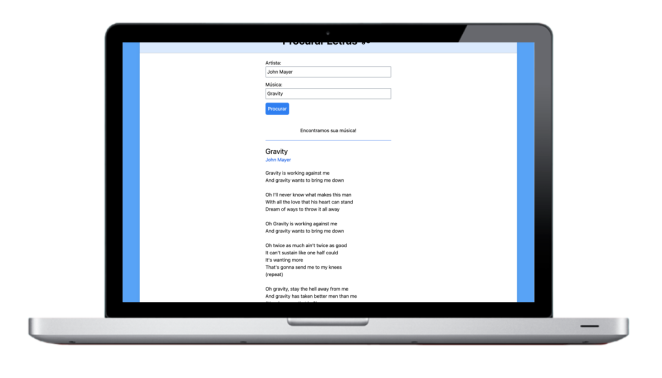

# Lyrics &middot;    

<div align="center">
  
</div>

<br/>

## 💡 Introduction

Web application song lyrics search

- Search for a song by typing Artist and Song Name
- Show full lyrics of the song searched

<br/>

## 🖥 Pre-requisites:

- NodeJS

<br/>

## 💾 How to Install Dependencies?

### Using NPM:

```
  npm install
```

### Using Yarn:

```
  yarn
```

<br/>

## 🚀 How to Run it?

### Using NPM:

```
  npm run dev
```

### Using Yarn:

```
  yarn dev
```

<br/>

## © License

MIT License © Yuri Paiva
