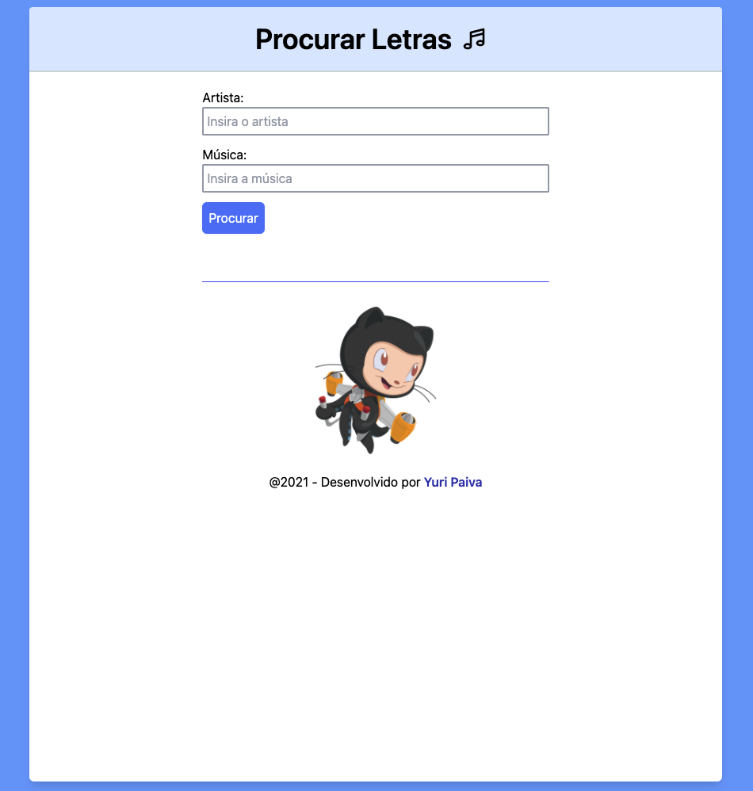

# Lyrics

App que pesquisa letras de música - Front-End feito em React - NextJS utilizando Typescript e TailWindCSS.

# Como funciona?

Para instalar as dependências do Node utilize o comando no terminal da pasta:
```
npm i
```

Para rodar a aplicação React localmente, em modo de desenvolvimento, utilize o seguinte comando no terminal da pasta:
```
npm run dev
```

# Explicando o projeto

Este projeto tem a intenção de fornecer ao usuário uma busca por letras de música através da API do Vagalume.

